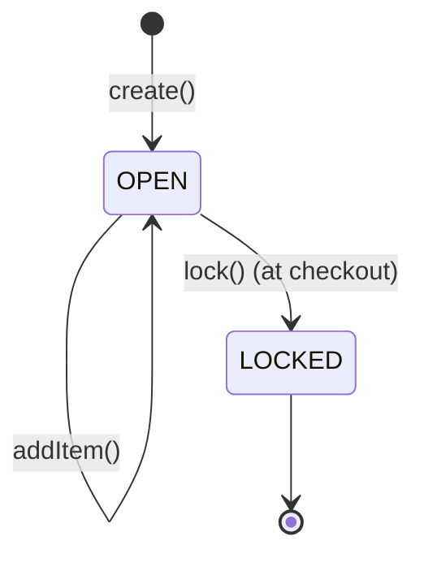
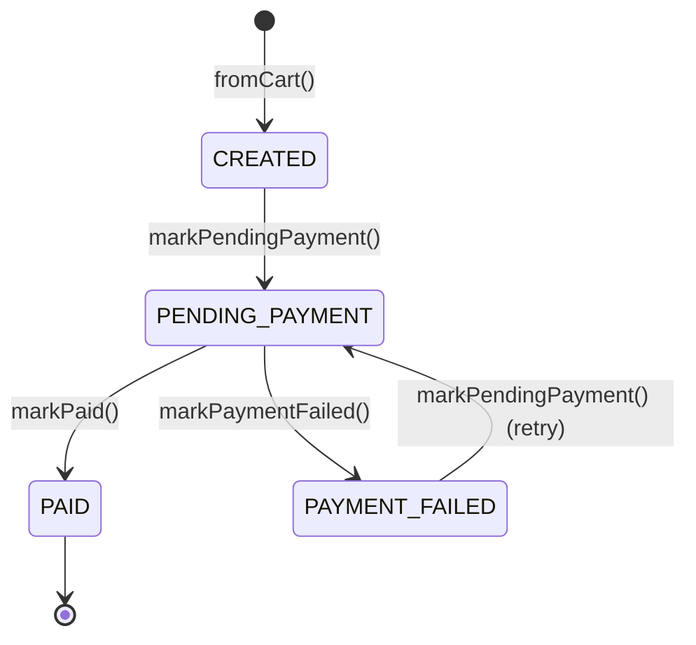
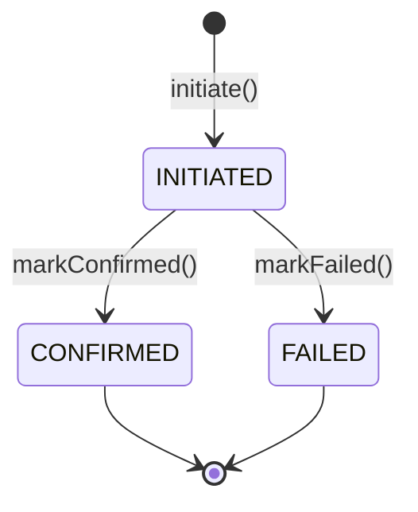
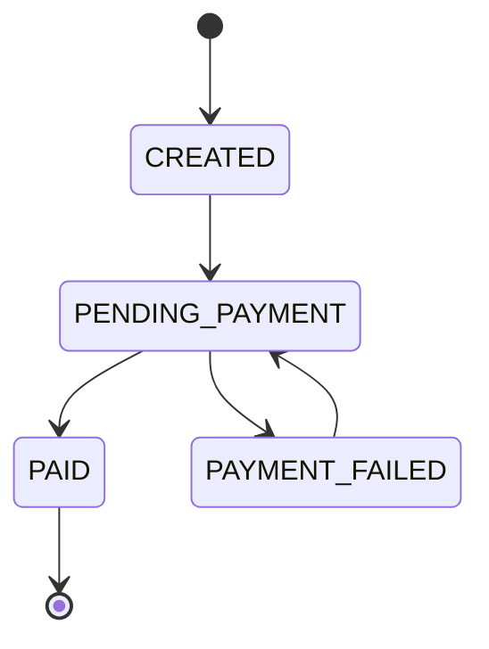
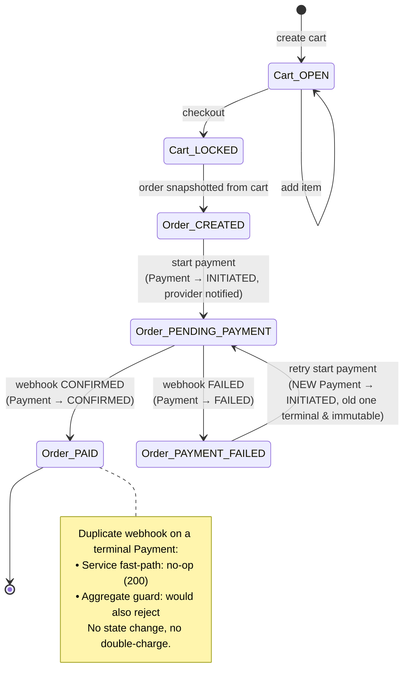
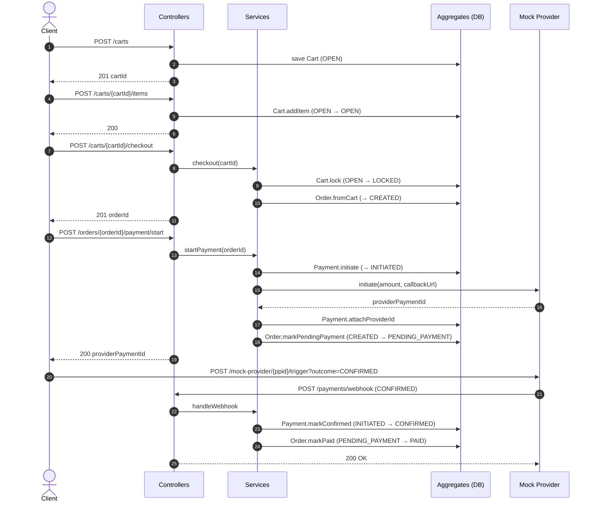
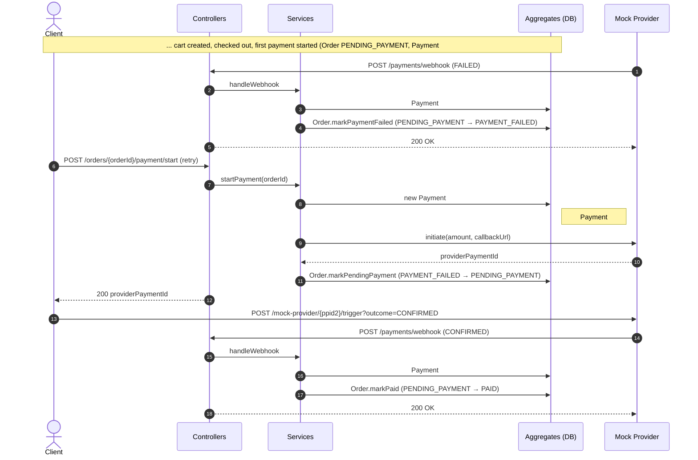
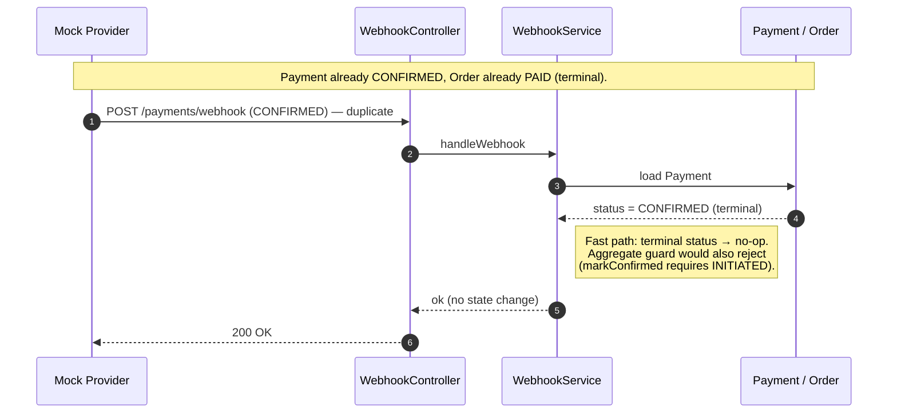
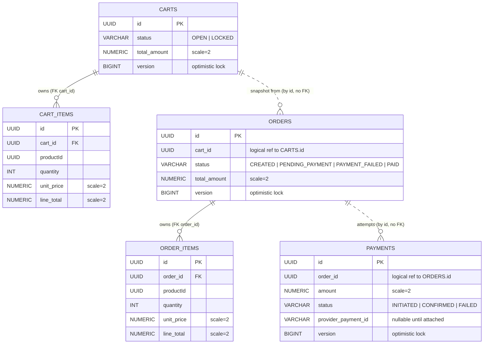
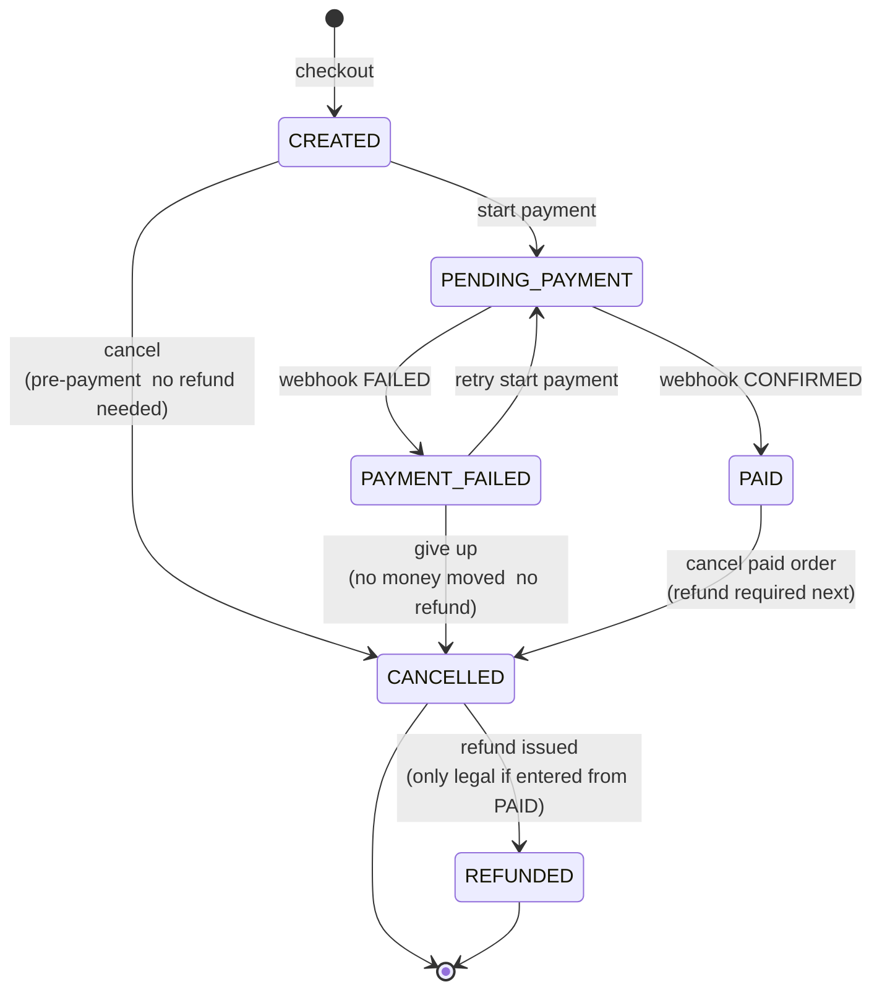

# Architecture

Deep-dive companion to the [README](README.md). Covers the state machines, webhook safety model, sequence diagrams for all three flows, the database schema, and the key design decisions (with links to the full rationale in [ai_usage_policy/DESIGN.md](ai_usage_policy/DESIGN.md)).

---

## State machines

State lives on the aggregates, not in services.   
Each behavior method enforces a legal transition, and illegal ones throw a domain exception that [GlobalExceptionHandler.java](src/main/java/com/cart/checkout/api/GlobalExceptionHandler.java) maps to **HTTP 409**.

### Cart  [Cart.java](src/main/java/com/cart/checkout/domain/cart/Cart.java)

Items can be modified while `OPEN`; checkout locks the cart and no further mutations are allowed.

### Order  [Order.java](src/main/java/com/cart/checkout/domain/order/Order.java)

The "no concurrent payment intents" rule falls out for free: `markPendingPayment` rejects if the order is already `PENDING_PAYMENT`. `PAID` is terminal.

### Payment  [Payment.java](src/main/java/com/cart/checkout/domain/payment/Payment.java)

Both terminal states are immutable  the basis of webhook idempotency. Retries create a new Payment, never mutate an old one. `markConfirmed`/`markFailed` additionally require `providerPaymentId` to be attached.

Full rationale in [ai_usage_policy/DESIGN.md §5](ai_usage_policy/DESIGN.md).

---

## Payment safety & webhook idempotency

Two layers protect against double-charges and duplicate webhooks:

- **Service fast path**  [WebhookService.java](src/main/java/com/cart/checkout/service/WebhookService.java) checks the Payment status; if it's already terminal (`CONFIRMED`/`FAILED`), the webhook is treated as a no-op and the response is still **200 OK** (returning non-2xx would trigger provider retries).
- **Aggregate safety net**  `Payment.markConfirmed` / `markFailed` reject any transition that isn't from `INITIATED`, so even a race that slipped past the service check can't corrupt state.
- **Optimistic locking**  `@Version` on Order and Payment makes the concurrent webhook + start-payment race fail loudly rather than silently overwriting.

Each retry creates a **new** Payment aggregate; failed and confirmed Payments are terminal and immutable, which gives you a complete audit history per attempt and is what makes the idempotency check trivially correct. The duplicate-webhook flow diagram below shows both layers at work.

---

## End-to-end behavior

The Order state machine is the spine of every flow. Here it is on its own:

The full picture below extends that spine with the Cart steps that precede it and the Payment-aggregate side-effects that happen on each transition (all in the same DB transaction). All three required flows  happy path, retry, duplicate webhook  fall out of this one diagram.

**How the three required flows read off this one diagram:**

| Flow | Path through the diagram |
|---|---|
| Happy path | `CREATED → PENDING_PAYMENT → PAID` |
| Payment failure + retry | `CREATED → PENDING_PAYMENT → PAYMENT_FAILED → PENDING_PAYMENT → PAID` (second arrival creates a fresh Payment) |
| Duplicate webhook | A second webhook hits the `PAID` note  fast-path no-op, 200 OK |

---

## Sequence diagrams

The three required flows, with the actual HTTP calls and the aggregate transitions each triggers. Every annotated step happens inside a single DB transaction (see [WebhookService.java](src/main/java/com/cart/checkout/service/WebhookService.java), [PaymentService.java](src/main/java/com/cart/checkout/service/PaymentService.java), [CheckoutService.java](src/main/java/com/cart/checkout/service/CheckoutService.java)).

### Happy path

### Payment failure + retry

### Duplicate webhook (idempotency)

Returning 200 here is deliberate — a non-2xx response would cause the provider to retry, amplifying the duplicate.

---

## Database schema

JPA-generated at startup (`ddl-auto=create-drop`, H2 in-memory). Solid edges are JPA-managed FKs; dashed edges are cross-context references stored as plain UUID columns (no FK constraint) to preserve bounded-context boundaries.

---

## Scope & key decisions

**Design choices**

- **State machine on the aggregate, not the service.** Illegal transitions are impossible to express, not just discouraged.  see [DESIGN.md §5](ai_usage_policy/DESIGN.md).
- **Payment-per-attempt model** for natural retry support and immutable audit history. Retries create a new Payment row; failed and confirmed Payments are terminal and immutable.  see [DESIGN.md §4.3](ai_usage_policy/DESIGN.md) and [DECISIONS.md](ai_usage_policy/DECISIONS.md).
- **Two-layer webhook idempotency** (service fast path + aggregate guard) instead of a separate event-id table  the terminal-status check is sufficient because Payment is immutable once terminal.  see [DESIGN.md §6.3](ai_usage_policy/DESIGN.md).
- **One-way dependency direction** `Cart ← Order ← Payment → Provider` keeps blast radius small and makes the contexts independently testable.  see [DESIGN.md §3](ai_usage_policy/DESIGN.md).
- **Domain exceptions → HTTP via `@ControllerAdvice`**, not scattered `try/catch` in services.  see [GlobalExceptionHandler.java](src/main/java/com/cart/checkout/api/GlobalExceptionHandler.java).

**Scope simplifications (intentional for this iteration)**

- **No auth, no webhook signature verification.** Single-tenant demo scope; in production both would be required.
- **JPA + H2 in-memory**, schema recreated each run (`ddl-auto=create-drop` in [application.properties](src/main/resources/application.properties)). State is lost on restart  intentional for a demo.
- **No `CANCELLED` order state**  kept as a documented extension so adding it later doesn't break invariants.
- **No item merging in the cart on duplicate `productId`**  each add appends a row.
- **No timestamps on the Order aggregate** (`paidAt` etc.). Time isn't load-bearing for the state machine in this iteration.
- **Mock provider runs in-process** but calls back over real HTTP (`mock.provider.callback-base-url`) so the webhook path is exercised end-to-end.

Full architectural trade-offs catalogue: [ai_usage_policy/DESIGN_ARCH_TRADEOFFS.md](ai_usage_policy/DESIGN_ARCH_TRADEOFFS.md). Implementation-time decisions (deviations from the design): [ai_usage_policy/IMPLEMENTATION_DECISIONS.md](ai_usage_policy/IMPLEMENTATION_DECISIONS.md).

---

## Extended Order state machine (future extensibility)

Not implemented today  shown so the two extensions called out in [requirements.md](requirements.md) (**cancellations** and **refunds**) can be added later without breaking the existing invariants. Extension lives on the **Order** aggregate because it's the customer-visible lifecycle (`I placed an order → I paid → I cancelled → I got my money back`). Payment stays terminal at `CONFIRMED`/`FAILED`  a refund is recorded as a separate `Refund` aggregate keyed to the confirmed Payment, mirroring the existing "Payment-per-attempt against Order" pattern.

**How the extensions read off this diagram:**

| Extension | Path through the diagram |
|---|---|
| Cancellation (pre-payment) | `CREATED → CANCELLED` (terminal, no money moved) |
| Cancellation (after retry exhausted) | `PAYMENT_FAILED → CANCELLED` (terminal, no money moved) |
| Cancellation + refund | `PAID → CANCELLED → REFUNDED` |

**How this is added without breaking the existing system:**

- Existing arrows untouched  extension is purely additive.
- `PAID` only leaves via a new explicit `POST /orders/{id}/cancel`; no existing endpoint can move an order off `PAID`.
- `CANCELLED` mode (terminal vs. refund-pending) enforced inside the aggregate, reuses the existing 409 mapping.
- Payment stays immutable once `CONFIRMED`; refunds are a new `Refund` aggregate, so webhook idempotency is unchanged.
- `Refund` reuses `Payment`'s lifecycle + `@Version` pattern  no new concurrency model.
- Schema change is additive (enum values + `refund` table); existing rows stay valid.
