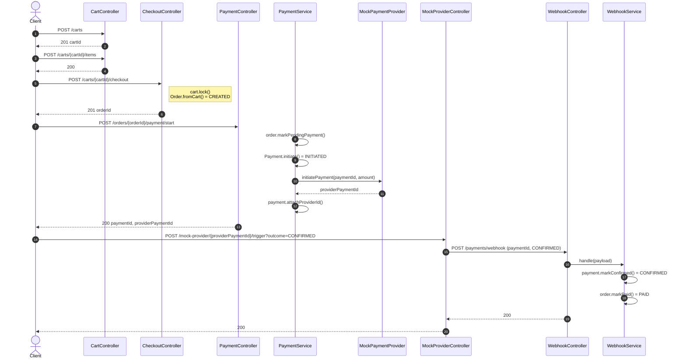
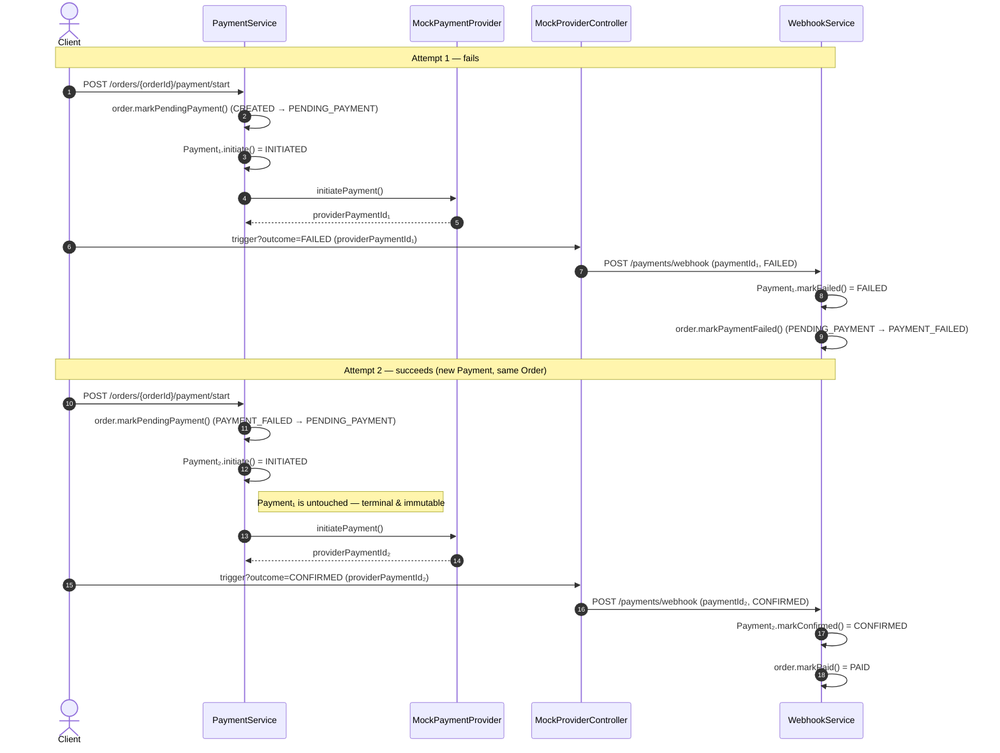
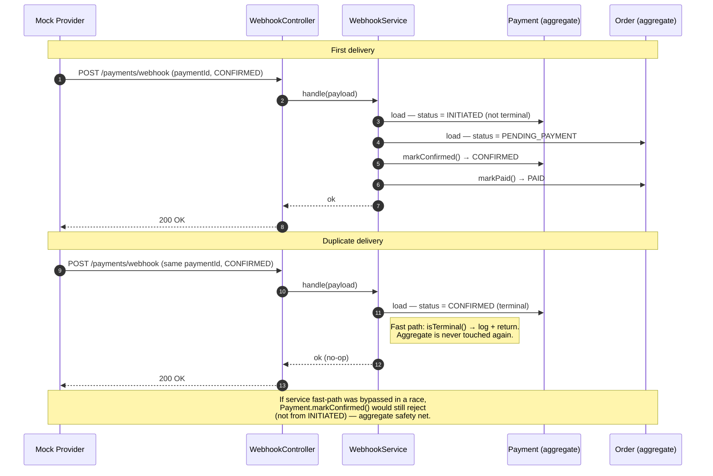

# Cart Checkout + Mock Payment System  Design Document

## 1. Overview

A single-service backend for a small e-commerce flow: create a cart, add items, checkout to produce an order, pay for it through a mock payment provider, and receive payment confirmation via webhook.

The system is small in scope but operates under strict correctness constraints  it handles money. The design prioritizes:

1. **Correctness over scale**  invariants are enforced at the aggregate level, not assumed.
2. **Idempotency**  webhooks can arrive more than once; the system stays correct.
3. **Explicit state machines**  no implicit transitions, no setters bypassing rules.
4. **Extensibility**  refunds, partial payments, and cancellations can be added later without breaking existing invariants.

---

## 2. Hard Constraints

### 2.1 Tech & Scope

- **Language / framework**: Java + Spring Boot
- **Persistence**: JPA + H2 (in-memory)
- **Deployment shape**: Single service, mock provider lives inside the same project behind an interface
- **Out of scope**: authentication, webhook signature verification

### 2.2 Non-Negotiable Correctness Invariants

1. Order state must always be correct
2. No double payments
3. No invalid state transitions
4. Webhooks may arrive twice → handler must be idempotent

### 2.3 State Machine

- **Required Order states**: `CREATED`, `PENDING_PAYMENT`, `PAYMENT_FAILED`, `PAID`
- **Valid transitions enforced**; illegal transitions rejected with a domain exception (translated to HTTP 409 at the API layer)
- `CANCELLED` is out of scope for this iteration  but the design must not preclude it

### 2.4 Cart Rules

- Items can be added only when cart is `OPEN`
- Checkout locks the cart (`OPEN → LOCKED`, one-way)
- Mutation attempts on a `LOCKED` cart are rejected with a clear error (HTTP 409)
- Checkout atomically: snapshot cart items into an Order, lock the cart, initialize Order state

### 2.5 Payment Rules

- `payment/start` transitions the order to `PENDING_PAYMENT`
- `payment/start` is **rejected when the order is already in `PENDING_PAYMENT`**  no second active intent (enforced naturally by the Order state machine, since only `CREATED` and `PAYMENT_FAILED` are valid source states)
- Webhook handler is idempotent: same event N times → same final state, no duplicate transitions, no duplicate side effects

### 2.6 Required API Surface

| Method | Path | Purpose |
|---|---|---|
| POST | `/carts` | Create cart |
| POST | `/carts/{cartId}/items` | Add item |
| POST | `/carts/{cartId}/checkout` | Convert cart → order |
| POST | `/orders/{orderId}/payment/start` | Start a payment attempt |
| POST | `/payments/webhook` | Receive payment outcome |

### 2.7 Mock Provider

- Simulates payment initiation, returns a unique `providerPaymentId`
- Allows external triggering of `CONFIRMED` / `FAILED` outcomes
- Calls our real `/payments/webhook` endpoint

### 2.8 Testing & Deliverables

- At least one unit test for a domain state transition (mandatory)
- Postman collection demonstrating system correctness (mandatory)
- Strongly recommended: integration tests for the happy path and the duplicate webhook case

### 2.9 Extensibility Constraint

The design must accommodate **refunds, partial payments, and cancellations** later without breaking core invariants. Concretely:

- The state machine is encoded as behavior methods, not flags  extending it is adding new methods, not editing existing ones.
- Payment is a separate aggregate from Order  supports multiple Payments per Order (already the case for retries; trivially extends to partials).
- Money is a value object  handles future multi-currency.

### 2.10 Implicit (Derived) Invariants

These follow directly from §2.2 and are binding even though they aren't bolded in the brief:

- **Optimistic locking on Order and Payment** via `@Version`  guards against concurrent webhook + start races.
- **No state mutation outside the aggregate**  all transitions go through aggregate behavior methods that enforce the state machine; no public setters.
- **Currency consistency**  all `Money` arithmetic and aggregate-internal totals must share a currency.
- **Transactional boundary**  state transition + persistence happens in a single DB transaction.

---

## 3. Bounded Contexts

Four contexts, each with its own internal layering (domain models, service, repository, controller where applicable).

| Context | Responsibility | Knows about |
|---|---|---|
| **Cart** | Cart lifecycle and items before checkout | nothing |
| **Order** | Committed purchase intent + state machine | Cart (consumes a snapshot) |
| **Payment** | Payment attempts, webhook reconciliation | Order (drives its state) |
| **Provider** | Abstraction over external payment provider | nothing about Cart/Order/Payment domain |

### Dependency direction (one-way only)

```
Cart    ←  Order  ←  Payment  →  Provider (interface)

Provider mock impl ──► results (paymentProviderId)
```

Cart never imports Order. Order never imports Payment. Payment depends on Order *by ID*, not by reference. 
Payment depends on Provider via interface only  never on the concrete mock implementation.

---

## 4. Domain Model

### 4.1 Cart

#### Aggregate: `Cart`

| Field | Type | Notes |
|---|---|---|
| `id` | UUID | |
| `status` | `CartStatus` enum | `OPEN`, `LOCKED` |
| `items` | List<CartItem> | managed by the aggregate; no external mutation |
| `total` | `Money` | derived from items |
| `version` | Long | `@Version`  optimistic locking |

**Invariants**

- Items can be added only while `status = OPEN`. Any modification on `LOCKED` → domain exception (HTTP 409).
- `total` is always consistent with the sum of `lineTotal` across items.
- Locking is one-way: `OPEN → LOCKED`. `lock()` on already-LOCKED cart is a **no-op** (idempotent).
  - ↪ *Superseded during implementation — see [IMPLEMENTATION_DECISIONS.md §4](IMPLEMENTATION_DECISIONS.md). `lock()` now throws `CartLockedException` on a second invocation; the "checked out once" invariant lives in the aggregate.*

**Behavior methods**

- `Cart.create()`  factory, returns a new OPEN cart
- `cart.addItem(productId, quantity, unitPrice)`  appends a **new** `CartItem` (no merging  simplification agreed for this iteration). Rejects if LOCKED. Recomputes total.
- `cart.lock()`  transitions to LOCKED; no-op if already LOCKED
- `cart.getTotal()`  derived `Money`

#### Entity: `CartItem`

| Field | Type | Notes |
|---|---|---|
| `id` | UUID | |
| `productId` | UUID | |
| `quantity` | int | > 0 |
| `unitPrice` | `Money` | ≥ 0 |
| `lineTotal` | `Money` | derived: `unitPrice × quantity` |

### 4.2 Order Context

#### Aggregate: `Order`

| Field | Type | Notes |
|---|---|---|
| `id` | `OrderId` (UUID) | |
| `cartId` | UUID | reference by ID, not by aggregate |
| `status` | `OrderStatus` enum | see §5 |
| `items` | List<OrderItem> | snapshot from cart at checkout |
| `totalAmount` | `Money` | |
| `version` | Long | `@Version` |

**Invariants**

- `totalAmount` is always consistent with `sum(item.lineTotal)`.
- `status` transitions only via behavior methods. No public setter on `status`.

**Behavior methods (the state machine lives inside Order)**

- `Order.fromCart(cart)`  factory: snapshots items, sets total, initializes `status = CREATED`, enforces currency invariant
- `order.markPendingPayment()`  valid from `CREATED` or `PAYMENT_FAILED`; else throws
- `order.markPaid()`  valid only from `PENDING_PAYMENT`; else throws
- `order.markPaymentFailed()`  valid only from `PENDING_PAYMENT`; else throws

Any invalid transition → `InvalidOrderTransitionException` → HTTP 409 at the API layer.

#### Entity: `OrderItem`

| Field | Type | Notes |
|---|---|---|
| `id` | `OrderItemId` | |
| `productId` | UUID | |
| `quantity` | int | > 0 |
| `unitPrice` | `Money` | |
| `lineTotal` | `Money` | derived |

### 4.3 Payment Context

#### Aggregate: `Payment`

| Field | Type | Notes |
|---|---|---|
| `id` | `PaymentId` (UUID) | also used as the idempotency key sent to the provider |
| `orderId` | `OrderId` | reference by ID |
| `amount` | `Money` | matches order currency |
| `status` | `PaymentStatus` enum | `INITIATED` \| `CONFIRMED` \| `FAILED` |
| `providerPaymentId` | String | set once, when provider acknowledges initiation |
| `version` | Long | `@Version` |

**Invariants**

- `amount.currency` equals the Order's currency at creation
- `providerPaymentId` is set once and is immutable afterward
- Once `status` is terminal (`CONFIRMED` or `FAILED`), no further transitions are possible

**Behavior methods**

- `Payment.initiate(orderId, amount)`  factory; status `INITIATED`, `providerPaymentId = null`
- `payment.attachProviderId(providerPaymentId)`  set once; rejects if already set
- `payment.markConfirmed()`  valid only from `INITIATED`, requires `providerPaymentId != null`
- `payment.markFailed()`  valid only from `INITIATED`, requires `providerPaymentId != null`

### 4.4 Provider Context

#### Interface

```
PaymentProvider
  initiatePayment(paymentId, amount) → ProviderInitiationResult { providerPaymentId }
```

That is the entire contract between Payment and Provider.

#### Mock implementation

A single class implementing `PaymentProvider`:

1. **`initiatePayment(...)`**  accepts the call, generates a unique `providerPaymentId`, stores enough internal state to know about pending payments, returns the id synchronously.
2. **A test/dev-facing trigger endpoint** (e.g. `POST /mock-provider/{providerPaymentId}/trigger?outcome=CONFIRMED|FAILED`)  instructs the mock to deliver an outcome.
3. **On trigger**, the mock posts to our own `/payments/webhook` endpoint with the payload below.

#### Webhook payload (incoming)

```json
{
  "paymentId": "<UUID  our id>",
  "providerPaymentId": "<string  provider's id>",
  "outcome": "CONFIRMED" | "FAILED"
}
```

This is a Provider-context DTO; the Payment service translates it into `markConfirmed()` / `markFailed()` on the aggregate.

### 4.5 Shared Value Object: `Money`

> ↪ *Superseded during implementation — see [IMPLEMENTATION_DECISIONS.md §1](IMPLEMENTATION_DECISIONS.md). `Money` was dropped; amounts are stored as raw `BigDecimal` (precision 19, scale 2) on aggregates and DTOs. Currency stays a label-invariant fixed to EGP, not a persisted field. The section below describes the original design.*

| Field | Type | Notes |
|---|---|---|
| `amount` | `BigDecimal` | scale 2, ≥ 0 |
| `currency` | String | EGP (fixed for this iteration; not hardcoded) |

- Immutable. Value equality.
- Arithmetic (`add`, `multiply`) only between same-currency instances; cross-currency operations throw.
- Currency is a label-invariant on the amount, not a separate concern carried independently.

---

## 5. State Machines

```
CREATED ──→ PENDING_PAYMENT ──→ PAID (terminal)
   │              │
   │              ├──→ PAYMENT_FAILED ──→ PENDING_PAYMENT (retry)
   │              │         │
   │              ▼         ▼
   └─────→ CANCELLED    (terminal)
```

## 6. User Flows

> ↪ *The prose flows below reference `/payments/{paymentId}/confirmed` and `/payments/{paymentId}/rejected` as the mock-provider trigger endpoint. Superseded during implementation — see [IMPLEMENTATION_DECISIONS.md §6](IMPLEMENTATION_DECISIONS.md). The implemented trigger endpoint is `POST /mock-provider/{providerPaymentId}/trigger?outcome=CONFIRMED|FAILED`, which posts to `/payments/webhook`. The sequence diagrams already show the updated path.*

### 6.1 Flow 1  Happy Path

1. `POST /carts` → cart created (`OPEN`)
2. `POST /carts/{id}/items` → items added
3. `POST /carts/{id}/checkout` → cart `LOCKED`, Order created (`CREATED`)
4. `POST /orders/{id}/payment/start`
   - Order transitions `CREATED → PENDING_PAYMENT`
   - New Payment created (`INITIATED`)
   - Payment provider called → returns `providerPaymentId`, attached to Payment
5. Mock Payment provider eventually calls `/payments/{paymentId}/confirmed` with `outcome = CONFIRMED`
   - Payment transitions `INITIATED → CONFIRMED`
   - Order transitions `PENDING_PAYMENT → PAID`



### 6.2 Flow 2  Payment Failure + Retry

1. `POST /carts` → cart created (`OPEN`)
2. `POST /carts/{id}/items` → items added
3. `POST /carts/{id}/checkout` → cart `LOCKED`, Order created (`CREATED`)
4. `POST /orders/{id}/payment/start`
   - Order transitions `CREATED → PENDING_PAYMENT`
   - New Payment created (`INITIATED`)
   - Payment provider called → returns `providerPaymentId`, attached to Payment
5. Mock Payment provider eventually calls `/payments/{paymentId}/rejected` with `outcome = FAILED`
   - Payment transitions `INITIATED → FAILED`
   - Order transitions `PENDING_PAYMENT → PAYMENT_FAILED`
6. Client calls `POST /orders/{id}/payment/start` again.
   - Order transitions `PAYMENT_FAILED → PENDING_PAYMENT` (legal  explicit edge in the state machine).
   - A **new** Payment₂ is created (`INITIATED`). Payment₁ remains `FAILED` forever.
7. Mock Payment provider eventually calls `/payments/{paymentId}/confirmed` with `outcome = CONFIRMED`
   - Payment transitions `INITIATED → CONFIRMED`
   - Order transitions `PENDING_PAYMENT → PAID`




### 6.3 Flow 3  Duplicate Webhook

1. `POST /carts` → cart created (`OPEN`)
2. `POST /carts/{id}/items` → items added
3. `POST /carts/{id}/checkout` → cart `LOCKED`, Order created (`CREATED`)
4. `POST /orders/{id}/payment/start`
   - Order transitions `CREATED → PENDING_PAYMENT`
   - New Payment created (`INITIATED`)
   - Payment provider called → returns `providerPaymentId`, attached to Payment
5. Mock Payment provider calls `/payments/{paymentId}/confirmed` with `outcome = CONFIRMED`  first arrival:
   - Payment transitions `INITIATED → CONFIRMED`
   - Order transitions `PENDING_PAYMENT → PAID`
   - Returns **200 OK**
6. Mock Payment provider calls `/payments/{paymentId}/confirmed` again with `outcome = CONFIRMED`  duplicate arrival:
   - Payment status is already `CONFIRMED` (terminal) → recognized as a duplicate
   - No transition is attempted on either aggregate
   - Returns **200 OK** (not an error  returning a non-200 would cause the provider to keep retrying)



#### The two-layer idempotency guard

| Layer | Mechanism | Purpose |
|---|---|---|
| **Service layer (primary)** | "if `payment.status` is terminal, treat as duplicate and return 200" | Clean, fast-path duplicate detection |
| **Aggregate (safety net)** | `markConfirmed()` / `markFailed()` reject if not from `INITIATED` | Final defense  even if service-layer check missed, the aggregate refuses the invalid transition |
| **Concurrency safety** | `@Version` on Payment and Order | If two webhook deliveries race concurrently, optimistic locking causes one transaction to fail; the failed one retries and now sees terminal status |

This is enough for this spec. A real production system might also persist a `ProcessedWebhookEvent` table keyed by a provider event-id with a unique constraint, which generalizes to providers that send multiple legitimate events per payment (e.g. authorized → captured → refunded). For this assignment, the terminal-status check is sufficient  out of scope to add the event-id table.

---

## 7. Component Architecture (within the single service)

Each context follows the same layering:

```
api (controller + dto)
       │
       ▼
    service ───────┐
       │           │
       ▼           ▼
   aggregate    repository
   (domain)     (loads / saves
       ▲         aggregate)
       │ implements
infrastructure adapter ──►  PaymentProvider port
(provider context only)     (in domain/payment)
```

The service depends on the repository (for persistence) and on the aggregate (for behavior) in parallel  the repository is not a layer between them, just the mechanism that hands the aggregate to the service and persists it again. Cross-context references are by ID only.

| Layer | Responsibility |
|---|---|
| **API (controller + DTO)** | HTTP I/O: parse request DTOs, call service, map result to response DTOs, translate exceptions to HTTP codes. Entities never cross this boundary. |
| **Service** | Use-case orchestration: load aggregates, call behavior methods, persist, handle idempotency duplicate-detection. Sole `@Transactional` boundary. |
| **Repository** | Spring Data JPA interface; load/save aggregates; nothing more. |
| **Domain (aggregate)** | Invariants, state machine, behavior. Owns the ports (interfaces) it consumes  no Spring beyond JPA annotations. |
| **Infrastructure** | Adapters that implement domain ports (e.g. mock `PaymentProvider`). Plugs in from outside; domain depends only on the interface. |

### 7.1 Exception → HTTP mapping

| Exception | HTTP | Where it originates |
|---|---|---|
| `CartLockedException` | 409 | `cart.addItem()` on LOCKED |
| `InvalidOrderTransitionException` | 409 | Order behavior methods on illegal source state |
| `InvalidPaymentTransitionException` | 409 | Payment behavior methods on terminal status |
| `ResourceNotFoundException` | 404 | Repository misses |
| `OptimisticLockingFailureException` | 409 (retry-safe) | Spring/JPA  concurrent update collision |

A `@ControllerAdvice` translates these centrally; controllers don't carry try/catch.

### 7.2 Transactional boundaries

- `checkoutService.checkout(cartId)`  single transaction: lock cart + create order + persist both
- `paymentService.startPayment(orderId)`  single transaction: transition order + create payment + persist; the call to the provider's `initiatePayment` happens after the order transition is validated; the result (providerPaymentId) is attached and persisted within the same transaction. (Provider call is in-process for the mock  no network concerns. For a real provider, this would need a different design: persist Payment as INITIATED first, *then* call the provider, *then* persist providerPaymentId  but that's out of scope.)
- `webhookService.handle(payload)`  single transaction: load payment, idempotency check, transition payment, transition order, persist

---

## 8. Testing Strategy

### 8.1 Minimum required

- **Unit test** for at least one Order state-transition invariant. Concrete suggestion: `markPaid()` from `PENDING_PAYMENT` succeeds; from any other state, throws `InvalidOrderTransitionException`. This single test covers both "valid transition works" and "invalid transition rejected".

### 8.3 Postman collection

The collection demonstrates each flow end-to-end:

1. Happy path  six requests in order
2. Failure + retry  two payment-start cycles
3. Duplicate webhook  same webhook fired twice, second is 200 no-op

Environment variables capture `cartId`, `orderId`, `paymentId`, `providerPaymentId` between calls.

---

