## 1. Business Flow (top-level)

High-level user journey from cart creation to a paid order.

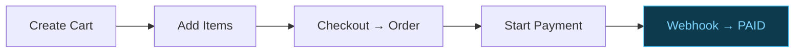

---

## 2. Bounded Contexts (Architecture)

Four contexts inside one service · one-way dependencies · references by ID only · dashed arrow = async webhook callback.

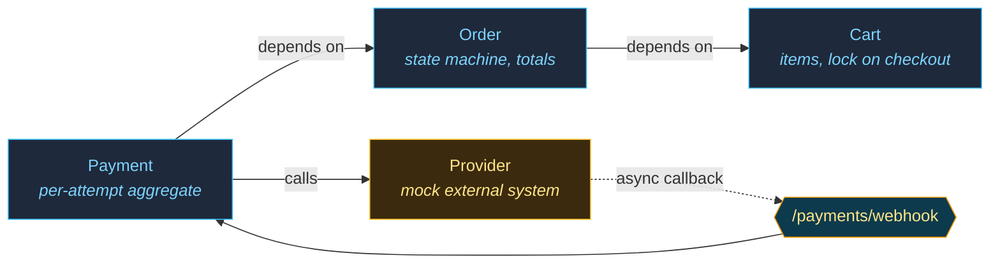

---

## 3. Layering Inside Each Context

Same shape per context: HTTP on top, domain at the bottom, invariants owned by the aggregate.

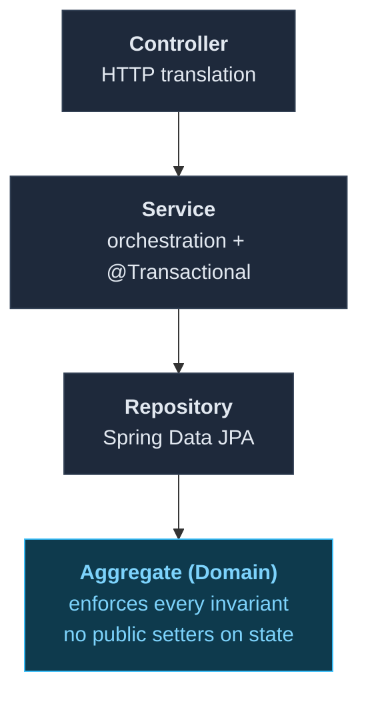

---

## 4. Domain Model & By-ID References

Three independent aggregates. Cross-context relationships are by **ID only** — no JPA association across boundaries.

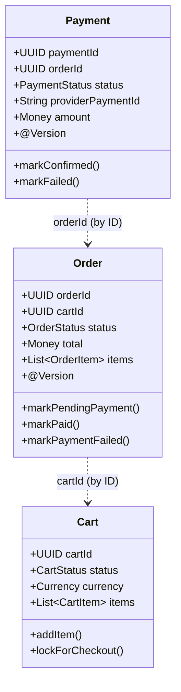

---

## 5. State Machines — Cart · Order · Payment

The Order state machine is the heart of the system. PAID, LOCKED, and CONFIRMED/FAILED are terminal.

### 5a. Cart

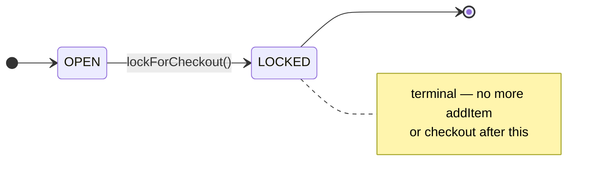

### 5b. Payment (per attempt)

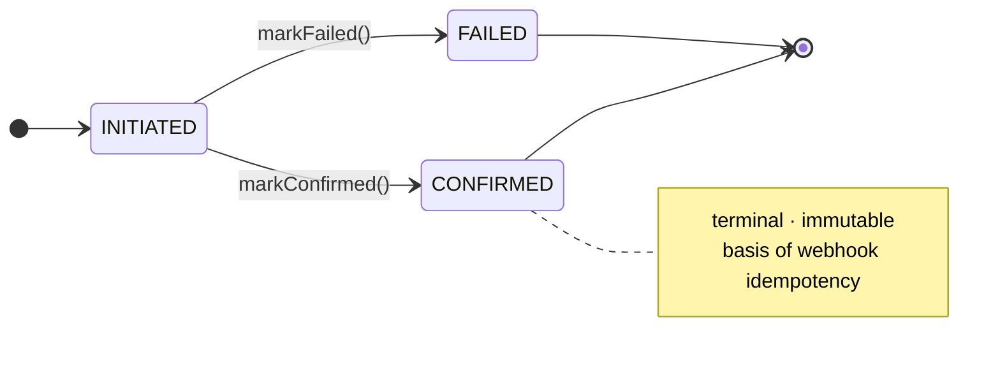

### 5c. Order — the heart of the system

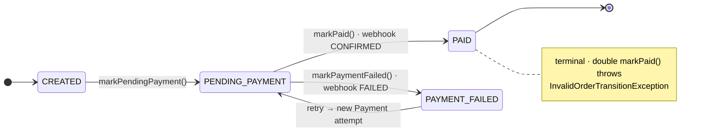

---

## 6. Payment-per-Attempt

Every retry creates a **new** Payment aggregate. Old attempts stay as immutable audit history.

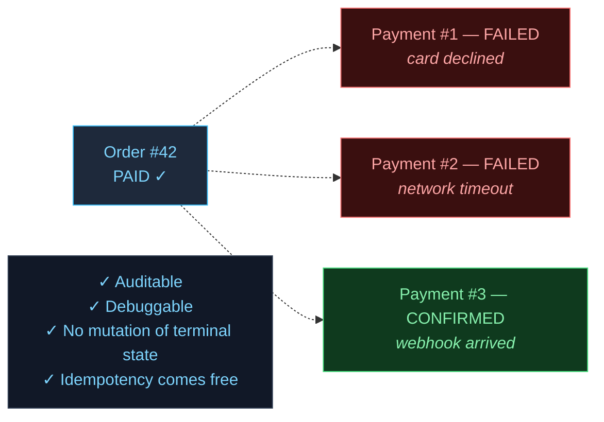

---

## 7. Flow 1 — Happy Path (Sequence)

Cart → checkout → start payment → provider initiates → mock provider triggers webhook → Order PAID.

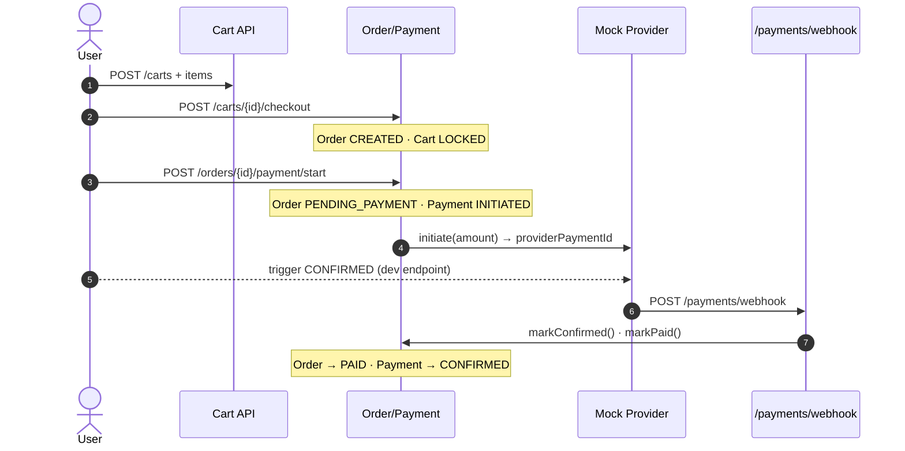

---

## 8. Flow 2 — Failure & Retry (Sequence)

First payment fails → Order `PAYMENT_FAILED` → retry creates a brand-new Payment #2 → eventually PAID.

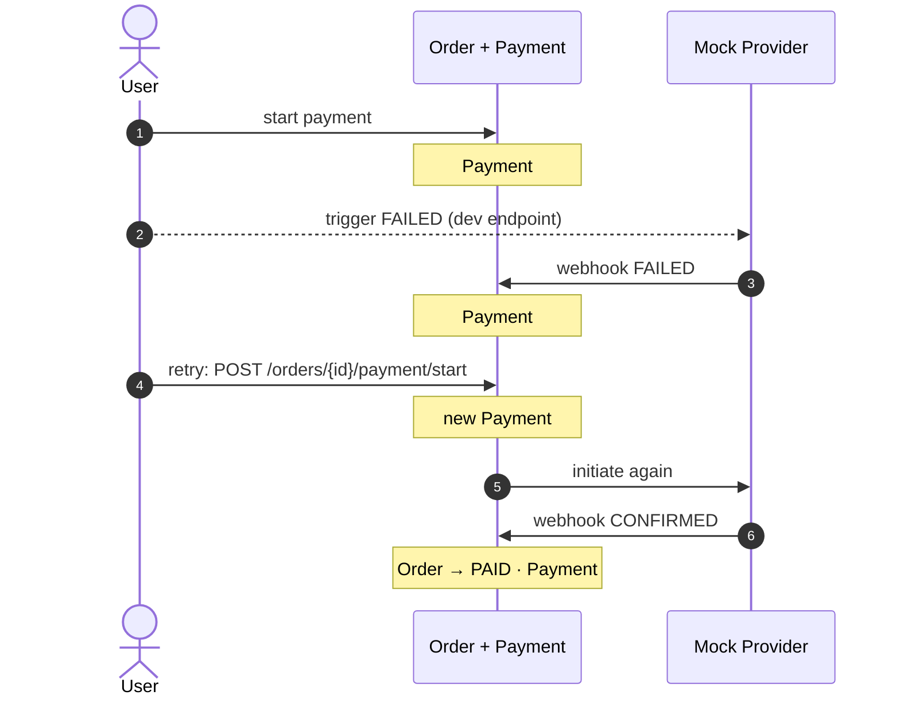

---

## 9. Flow 3 — Duplicate Webhook (Sequence)

First webhook lands and transitions state · second webhook hits Layer 1 fast-path and is a no-op. Always 200 OK.

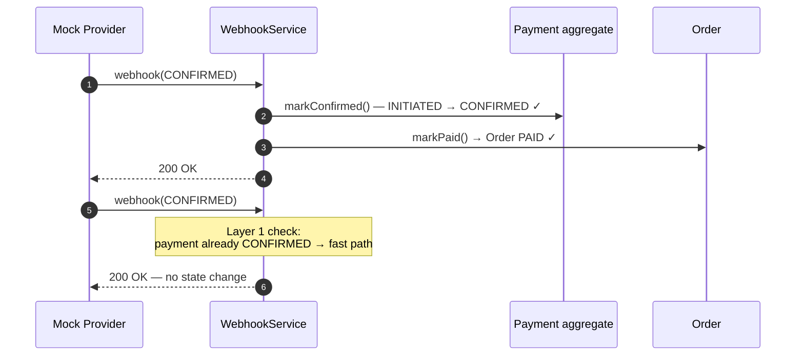

---

## 10. Idempotency — Two Layers (Defense in Depth)

Service-layer fast path catches duplicates cheaply · the aggregate is a safety net if anything slips through.

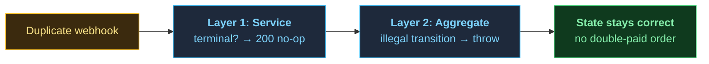

---

## 11. Concurrency — Optimistic Locking

Two transactions read the same Order version · TXN A commits and bumps the version · TXN B fails with `OptimisticLockException` and rolls back cleanly.

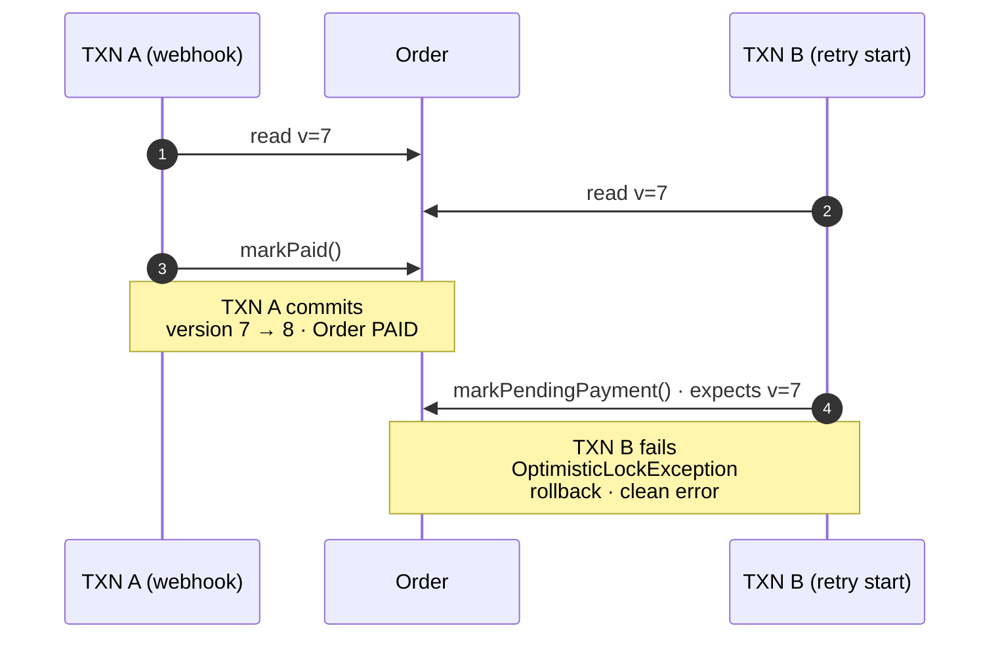

**Result:** no silent overwrite, no lost update. The caller can retry against the correct state.

---

### 12. Future extensibility (refunds cancellations)

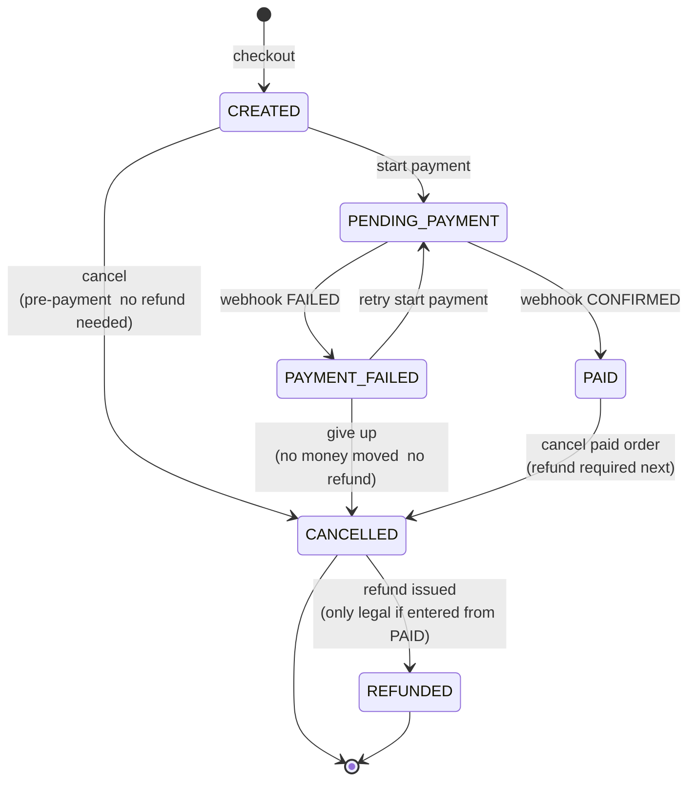